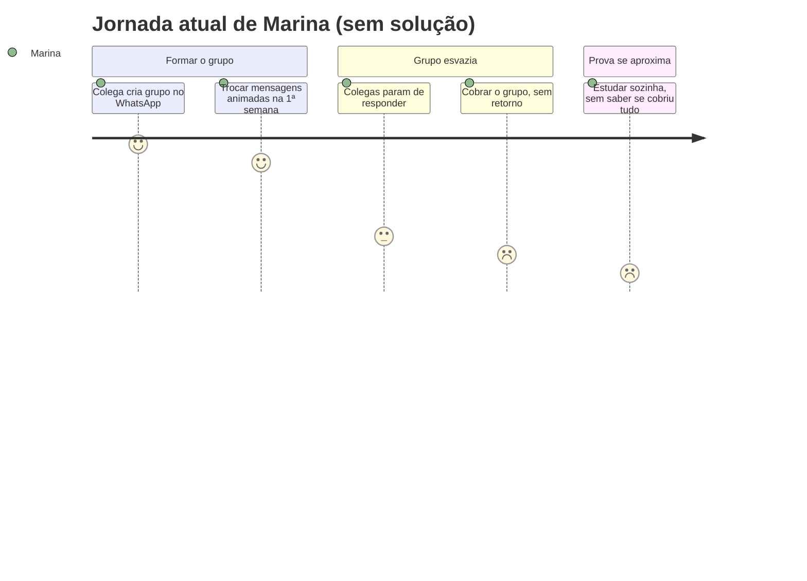

# Cenário de Análise/Problema

> **_NOTE:_**: A equipe deve pensar em cenários existentes na atualidade (que causam problemas para os usuários) e que a interface prevista ajudará a resolver o problema. Cenário de Análise/Problema é uma história triste. Não descreve a solução. Descreve somente o problema.

1) **Cenário de Análise/Problema**
- Escreva uma narrativa (não uma lista de requisitos) contando como a persona vive o problema hoje.
- Baseie-se nas dores identificadas no [Perfil do Usuário](3_perfil_usuario.md) e no [Mapa de Empatia](4_personas.md) — não invente um problema novo.
- Não mencione o produto/serviço que a equipe vai construir; a história descreve a vida da persona **antes** dele existir.

2) **Questões de Refinamento**
- Levante perguntas sobre o cenário que ainda ficaram em aberto: por que isso acontece? Acontece sempre ou só às vezes? Quem mais é afetado? O que a persona já tentou para resolver?
- O objetivo é encontrar lacunas e suposições no cenário inicial, não respondê-las ainda.

3) **Refinamento do Cenário de Análise/Problema**
- Reescreva o cenário incorporando as respostas às questões de refinamento, tornando-o mais específico, concreto e verificável.

4) **Contexto de Uso**
- Descreva o ambiente em que o problema ocorre (e onde o futuro produto/serviço deverá ser utilizado).
- Qual/quais o(s) contexto(s) sociais, econômicos e culturais existentes neste ambiente?
- Quais informações sobre o ambiente devem ser consideradas antes de qualquer interação?
- O que normalmente está acontecendo no ambiente quando o problema ocorre?

5) **Jornada do Usuário (atual, sem solução)**
- Descreva a jornada da persona enfrentando o problema **hoje**, do início ao fim do cenário — sem envolver o produto/serviço que a equipe vai construir.
- Aponte, em cada etapa, o estado emocional da persona (frustração, confiança, dúvida, satisfação).
- Complemente com um diagrama de jornada (`journey`) do Mermaid, agrupando as etapas em seções e atribuindo uma nota de 1 (péssimo) a 9 (ótimo) ao estado emocional de cada uma.

---

## Exemplo de entrega

> Continuação do exemplo fictício do app "Estuda+", usando a persona [Marina Souza](4_personas.md). Copie a estrutura, não o conteúdo.

### 1) Cenário de Análise/Problema

Marina está no 4º semestre e, como sempre faz antes de provas, entra em um grupo de WhatsApp criado por uma colega para estudar Estruturas de Dados junto com mais quatro pessoas da turma. Na primeira semana, todo mundo manda mensagens animadas combinando encontros e trocando resumos. Mas ninguém definiu quem ficaria responsável por qual tópico, e aos poucos as mensagens ficam mais espaçadas. Duas semanas antes da prova, o grupo está praticamente silencioso — só restam mensagens antigas sem resposta. Marina não sabe se deve cobrar os colegas, criar outro grupo do zero ou simplesmente desistir e estudar sozinha, como acabou fazendo nas últimas duas vezes.

### 2) Questões de Refinamento

- Isso acontece com todos os grupos de estudo da Marina ou só com alguns?
- Por que ninguém assume a organização do grupo depois da primeira semana?
- O problema é falta de ferramenta (lembrete, divisão de tarefas) ou falta de compromisso dos colegas?
- Existe um momento específico em que o grupo começa a esvaziar?
- Marina já tentou algo para reverter a situação? O que aconteceu?

### 3) Refinamento do Cenário de Análise/Problema

Nas três últimas vezes em que Marina participou de grupos de estudo, o padrão se repetiu: o grupo é criado de forma informal, sem que ninguém assuma explicitamente a organização, e sem dividir quem estuda qual tópico. Passada a primeira semana — justamente quando o volume de conteúdo aumenta e a rotina de estágio de Marina fica mais apertada —, as respostas somem. Ela já tentou mandar mensagem cobrando o grupo duas vezes, mas se sentiu "chata" fazendo isso e parou. O problema não é falta de vontade de estudar em grupo: é a ausência de qualquer estrutura (divisão de tópicos, lembretes, um responsável) que sustente o grupo depois do entusiasmo inicial.

### 4) Contexto de Uso

- Marina usa o celular entre aulas e à noite, geralmente em casa ou na biblioteca da faculdade, com Wi-Fi ou 4G.
- Contexto social: grupo de 4-6 colegas de turma, sem hierarquia definida — ninguém "responsável" formalmente pelo grupo.
- O problema se intensifica na semana anterior às provas, quando o volume de conteúdo e a ansiedade aumentam.
- Marina normalmente está com atenção dividida (entre uma aula e outra, ou cansada depois do estágio) quando tenta engajar o grupo.

### 5) Jornada do Usuário (atual, sem solução) — Marina

| Etapa | O que acontece | Estado emocional |
| :---- | :---- | :---- |
| 1. Criação do grupo | Uma colega cria um grupo no WhatsApp e convida a turma para estudar juntos. | Animada |
| 2. Primeira semana | Mensagens trocadas com entusiasmo, mas sem definir quem estuda o quê. | Confiante |
| 3. Silêncio no grupo | Colegas param de responder; ninguém assume a organização. | Frustrada |
| 4. Tentativa de reverter | Marina manda uma mensagem cobrando o grupo; poucas ou nenhuma resposta. | Insegura |
| 5. Véspera da prova | Marina desiste do grupo e estuda sozinha, sem saber se cobriu os tópicos certos. | Exausta / decepcionada |

