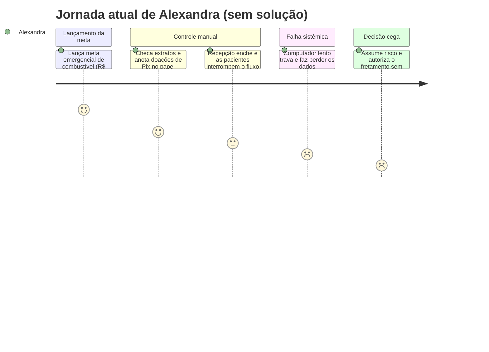
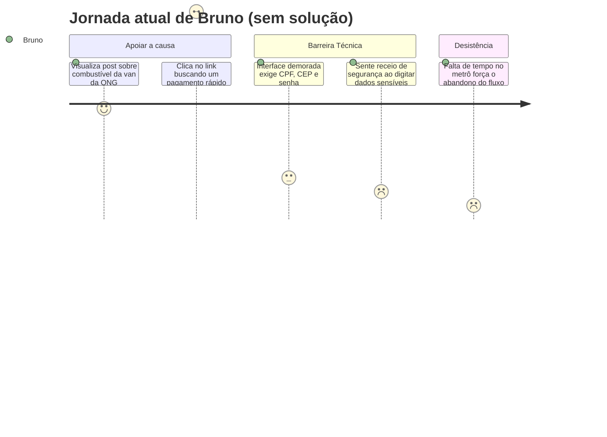

# Cenário de Análise/Problema

> **_NOTE:_**: A equipe deve pensar em cenários existentes na atualidade (que causam problemas para os usuários) e que a interface prevista ajudará a resolver o problema. Cenário de Análise/Problema é uma história triste. Não descreve a solução. Descreve somente o problema.

1) **Cenário de Análise/Problema**
- Escreva uma narrativa (não uma lista de requisitos) contando como a persona vive o problema hoje.
- Baseie-se nas dores identificadas no [Perfil do Usuário](3_perfil_usuario.md) e no [Mapa de Empatia](4_personas.md) — não invente um problema novo.
- Não mencione o produto/serviço que a equipe vai construir; a história descreve a vida da persona **antes** dele existir.

Persona Primária 2: Alexandra Almeida (A Gestora da ONG)

Alexandra está na recepção física da sede da ONG na Vila Mariana, tentando consolidar as contas da campanha mensal de arrecadação contra o custo operacional fixo de R$ 9.500. O ambiente está caótico: telefones fixos tocam com hospitais agendando pacientes, voluntários entram e saem de salas perguntando sobre escalas de Reiki, e dezenas de assistidas conversam alto na sala ao lado aguardando a oficina de lenços. Para liberar a rota do motorista da van no dia seguinte, Alexandra precisa conferir se as doações pontuais de Pix recebidas cobrem os R$ 1.500 devidos ao combustível da semana. Ela abre o aplicativo do banco em seu celular enquanto tenta ler uma planilha de controle manual do computador desktop antigo da recepção, que possui um monitor de baixa resolução e teclado duro. Com a recepção cheia de pacientes pedindo orientações e com a luz fluorescente forte cansando suas vistas, o computador trava ao carregar o arquivo Excel. Alexandra perde os últimos dados inseridos manualmente e fica sem saber com precisão se a meta foi atingida, correndo o risco de deixar o transporte desabastecido por falta de controle de caixa.

2) **Questões de Refinamento**
- Levante perguntas sobre o cenário que ainda ficaram em aberto: por que isso acontece? Acontece sempre ou só às vezes? Quem mais é afetado? O que a persona já tentou para resolver?
- O objetivo é encontrar lacunas e suposições no cenário inicial, não respondê-las ainda.

- 1. O descontrole de metas financeiras e o travamento do sistema ocorrem em todas as campanhas ou se intensificam em períodos de pico como o Outubro Rosa e Natal?

- 2. Por que Alexandra centraliza a conferência manual de Pix e planilhas em vez de delegar para o conselho fiscal ou assistentes?

- 3. O problema administrativo é a falta de uma ferramenta automatizada que exiba as doações recebidas de forma visual ou é a lentidão do hardware antigo da ONG?

- 4. Qual o momento do dia em que Alexandra possui maior tempo de foco para tarefas administrativas sem ser interrompida pelas pacientes presenciais?

- 5. Quais tentativas anteriores de automatizar o caixa foram feitas e por que foram abandonadas em favor das planilhas de papel?

3) **Refinamento do Cenário de Análise/Problema**
- Reescreva o cenário incorporando as respostas às questões de refinamento, tornando-o mais específico, concreto e verificável.

A rotina de Alexandra é marcada por multitarefa extrema e sobrecarga administrativa. Como as diretoras exercem trabalho puramente voluntário e sem funcionários contratados para o financeiro, ela divide seu tempo entre a captação de recursos, recepção de pacientes, atendimento telefônico e escala de salas. A checagem manual de Pix e o cruzamento com planilhas consomem horas diárias e geram estresse severo. As doações de Pix automático e doações caindo diretamente em banco sem sincronização com o controle local criam um ponto cego orçamentário. O problema real de Alexandra não é a falta de doadores engajados, mas a ausência de um painel integrado que consolide as campanhas de crowdfunding em tempo real e mostre as metas batidas através de um dashboard visual de alto contraste e comandos fáceis, reduzindo drasticamente o esforço cognitivo sob o contexto de constantes interrupções presenciais.

4) **Contexto de Uso**
- Descreva o ambiente em que o problema ocorre (e onde o futuro produto/serviço deverá ser utilizado).
- Qual/quais o(s) contexto(s) sociais, econômicos e culturais existentes neste ambiente?
- Quais informações sobre o ambiente devem ser consideradas antes de qualquer interação?
- O que normalmente está acontecendo no ambiente quando o problema ocorre?

- Dispositivo e Rede: Alexandra opera o dashboard administrativo em um computador desktop antigo e lento da secretaria da ONG, com monitor de baixa resolução que dificulta a leitura de fontes pequenas. A conexão de rede é de banda larga compartilhada e com lentidão nos horários de oficina.

- Ambiente Físico/Ambiental: Secretaria barulhenta e de alta circulação presencial, com iluminação fluorescente intensa que gera cansaço visual após poucas horas na frente da tela.

- Contexto Social/Cognitivo: Constantes interrupções físicas de pacientes e voluntários (a cada 3 a 5 minutos). Carga cognitiva e emocional altíssima decorrente do acolhimento diário de mulheres debilitadas em tratamento oncológico de alta vulnerabilidade.

5) **Jornada do Usuário (atual, sem solução)**
- Descreva a jornada da persona enfrentando o problema **hoje**, do início ao fim do cenário — sem envolver o produto/serviço que a equipe vai construir.
- Aponte, em cada etapa, o estado emocional da persona (frustração, confiança, dúvida, satisfação).
- Complemente com um diagrama de jornada (`journey`) do Mermaid, agrupando as etapas em seções e atribuindo uma nota de 1 (péssimo) a 9 (ótimo) ao estado emocional de cada uma.

| Etapa | O que acontece | Estado emocional |
| :---- | :---- | :---- |
| 1. Lançamento da meta | Alexandra estipula a meta de arrecadação de R$ 1.500 para garantir a manutenção das vans. | Ansiosa / Sob Pressão |
| 2. Conferência manual | Ela abre o aplicativo do banco e começa a anotar cada Pix pontual que cai no extrato. | Sobrecarregada |
| 3. Interrupção presencial | Alexandra precisa parar a checagem no meio do caminho para atender pacientes na recepção e responder ao telefone. | Estrada |
| 4. Travamento de dados | O computador antigo trava ao abrir a planilha de conferência, forçando a reinicialização e perda das anotações rápidas. | Frustrada |
| 5. Decisão de risco | Diante da incerteza se os R$ 1.500 de combustível foram alcançados, ela assume o risco e autoriza o fretamento às cegas. | Insegura |

---

### 1) Cenário de Análise/Problema

Persona Primária 1: Bruno Silva (O Doador / Apoiador)

Bruno está voltando para casa de metrô após um dia exaustivo de trabalho e abre o Instagram para passar o tempo. Ele visualiza uma postagem tocante da ONG Eliane Martins indicando que o combustível do transporte fretado (van) que busca pacientes oncológicas em locais distantes está prestes a acabar. Sabendo que a locomoção das assistidas é vital para o tratamento, ele se sente motivado a apoiar com R$ 20 para ajudar a bater a meta emergencial do combustível. Bruno clica no link do perfil para realizar a doação, mas é redirecionado a um portal antigo e desconfigurado para celulares. Logo de início, o sistema o obriga a preencher um longo formulário cadastral exigindo CPF, endereço residencial complexo, CEP, telefone e a criação de uma senha forte com caracteres especiais para abrir uma conta antes de selecionar o valor do pagamento. Sob a oscilação de sinal de rede dentro do vagão em movimentos e preocupado com a segurança de digitar dados tão sensíveis em um site que não lhe transmite confiança visual, Bruno hesita. Antes que consiga preencher o CEP, o trem chega à sua estação. Frustrado com o tempo gasto e com a burocracia desnecessária, ele bloqueia o celular e desiste de doar, como acabou nas últimas vezes em que tentou apoiar causas similares.

### 2) Questões de Refinamento

- 1. A desistência de doar ocorre em todos os tipos de campanhas online que Bruno tenta apoiar ou é um atrito específico de portais de ONGs locais?

- 2. Por que o sistemas de doação digital exigem cadastros longos (exigindo CPF e endereço) para transações financeiras de baixo valor pontual?

- 3. O maior obstáculo de abandono de Bruno no metrô é a falta de tempo/distração ou a fadiga física de preenchimento de formulários?

- 4. Até que ponto o meio de pagamento ofertado influi na decisão: a ausência do Pix é um fator determinante para a desistência?

- 5. Como a falta de um retorno transparente sobre a destinação impacta o sentimento de segurança de Bruno?

### 3) Refinamento do Cenário de Análise/Problema

Nas últimas tentativas de doação digital de Bruno, o padrão de barreira de usabilidade e segurança técnica se repetiu: checkouts com alta carga cognitiva de que não aplicam princípios de design responsivo. Por possuir uma rotina exaustiva de trabalho, sua tolerância a fluxos poluídos e processos burocráticos de cadastramento é mínima. A pesquisa de campo comprovou cientificamente essa dor: o processo de cadastro é o maior motivo de desistência do público, seguido de perto pela falta de clareza na destinação do dinheiro e por interfaces que parecem antigas ou inseguras. O problema real de Bruno não é a indisponibilidade financeira de apoiar os R$ 1.500,00 de combustível da van que busca as pacientes, mas sim a total ausência de uma rota de Doação Expressa via Pix em tela única e livre de criação de contas ou senhas.

### 4) Contexto de Uso

- Dispositivo e Conexão: Bruno opera o sistema exclusivamente por meio de seu smartphone pessoal de tela média, dependendo de internet móvel (4G/5G) instável e de alta latência durante deslocamentos urbanos.

- Ambiente Físico: Vagão de metrô lotado e barulhento, movimentação que prejudica a precisão do toque na tela e luz artificial que exige alto contraste de interface.

- Contexto Social e Cognitivo: Nível de familiaridade tecnológica alto. Bruno lida com atenção extremamente fragmentada por distrações visuais e fadiga cognitiva após o horário de expediente, exigindo fluxos de checkout concluídos em menos de 1 minuto.

### 5) Jornada do Usuário (atual, sem solução) — Marina

| Etapa | O que acontece | Estado emocional |
| :---- | :---- | :---- |
| 1. Descoberta da causa | Visualiza post na rede social sobre a falta de combustível da van da ONG e decide doar R$ 20. | Motivado |
| 2. Tentativa de acesso | Clica no link do perfil, mas o portal abre de forma lenta e desconfigurada no celular. | Inseguro |
| 3. Barreira cadastral | O formulário exige criação de senha, CPF, CEP e endereço completo para liberar o pagamento. | Frustrado |
| 4. Medo de fraude | Sente receio de digitar seus dados sensíveis de pagamento em uma interface poluída e antiga | Desconfiado |
| 5. Abandono do fluxo | O metrô chega à sua estação e, sem tempo para concluir o preenchimento, Bruno fecha o app e desiste. | Culpado / Decepcionado |

