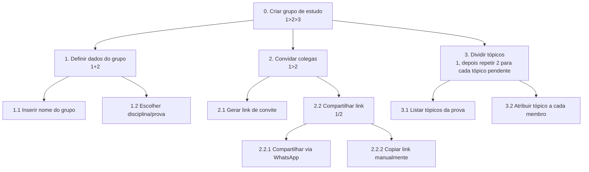

# Análise de Tarefas

> **_NOTE:_**: Enquanto o Cenário de Análise/Problema descreve a situação em prosa, a Análise de Tarefas modela formalmente como o usuário executa as funcionalidades mais importantes da interface/produto. Isso alimenta diretamente a Arquitetura de Informação e o Fluxo do Usuário na próxima etapa.

A equipe deve modelar pelo menos **1 HTA e 1 GOMS**, cobrindo ao menos **4 funcionalidades diferentes** entre os dois modelos. Cada diagrama/tabela deve vir acompanhado de um texto explicando a funcionalidade modelada.

1) **HTA (Hierarchical Task Analysis)**
- Decomponha a tarefa em objetivo principal → subtarefas → operações, em uma estrutura hierárquica (árvore).
- Todo nó que tiver mais de um filho deve trazer, dentro da própria caixa, o **plano de execução** referenciando os filhos pelo número local (1, 2, 3...): `>` sequência (ex.: `1>2` = faça 1, depois 2), `+` simultâneo/sem ordem definida (ex.: `1+2` = faça 1 e 2, em qualquer ordem), `/` alternativa (ex.: `1/2` = faça 1 ou 2, não ambos). Quando o plano não se encaixar nesses três casos (ex.: repetição), descreva-o em prosa dentro da caixa.

2) **GOMS (Goals, Operators, Methods, Selection Rules)**

Escreva como um esboço textual hierárquico (não em tabela), no formato:

- `GOAL n`: o objetivo (pode ser decomposto em subgoals `GOAL n.1`, `GOAL n.2`...).
- `METHOD n.X`: um dos métodos possíveis para atingir o goal acima, identificado por uma letra (`A`, `B`, `C`...).
- `(SEL. RULE: ...)`: logo abaixo de cada METHOD, entre parênteses — a condição que leva o usuário a escolher esse método em vez de outro. Só existe quando há mais de um método para o mesmo goal.
- `OP. n.X.k`: os operadores (ações atômicas — clique, digitação, gesto, verificação visual) que compõem o método, numerados em sequência.

---

## Exemplo de entrega

> Continuação do exemplo fictício do app "Estuda+". Copie a estrutura, não o conteúdo.

### HTA — Criar um grupo de estudo

**Funcionalidade**: permitir que um aluno crie um novo grupo de estudo e convide colegas, definindo os tópicos a dividir.

> O plano fica escrito dentro da própria caixa do nó pai, logo abaixo da descrição da tarefa.



- **Plano 0 (`1>2>3`)**: definir os dados do grupo, depois convidar colegas, depois dividir os tópicos — nessa ordem.
- **Plano 1 (`1+2`)**: nome do grupo e disciplina/prova são preenchidos no mesmo formulário, em qualquer ordem.
- **Plano 2 (`1>2`)**: só é possível compartilhar o link depois de gerá-lo.
- **Plano 2.2 (`1/2`)**: o organizador escolhe **um** dos dois canais — WhatsApp ou copiar o link manualmente — nunca os dois.
- **Plano 3 (`1>2`)**: lista os tópicos da prova e depois atribui responsável para cada tópico pendente.

### GOMS — Marcar um tópico como estudado

**Funcionalidade**: permitir que o participante registre que concluiu o estudo de um tópico atribuído a ele.

```
GOAL 0: marcar o tópico "Grafos" como estudado

  GOAL 1: chegar até a tela do tópico "Grafos"

    METHOD 1.A: navegar pela aba "Meu grupo"
    (SEL. RULE: app está na tela inicial, sem notificação pendente)
      OP. 1.A.1: tocar na aba "Meu grupo"
      OP. 1.A.2: localizar o tópico "Grafos" na lista
      OP. 1.A.3: tocar no tópico "Grafos"

    METHOD 1.B: acessar direto pela notificação
    (SEL. RULE: existe notificação de lembrete para o tópico "Grafos")
      OP. 1.B.1: tocar na notificação do lembrete
      OP. 1.B.2: aguardar a tela do tópico abrir

  GOAL 2: confirmar a conclusão do tópico
    METHOD 2.A: marcar como concluído
      OP. 2.A.1: tocar no botão "Concluí"
      OP. 2.A.2: confirmar na caixa de diálogo
```