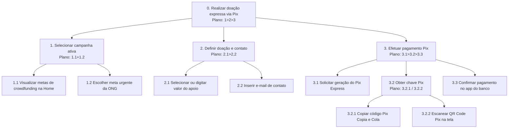
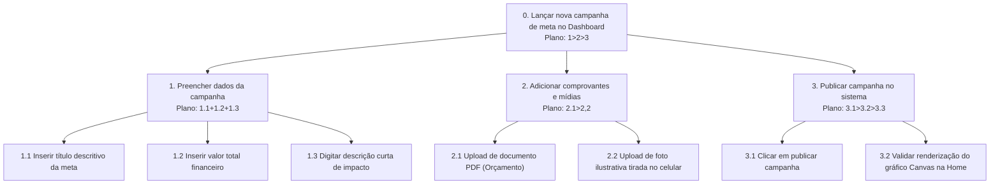

# Análise de Tarefas

> **_NOTE:_**: Enquanto o Cenário de Análise/Problema descreve a situação em prosa, a Análise de Tarefas modela formalmente como o usuário executa as funcionalidades mais importantes da interface/produto. Isso alimenta diretamente a Arquitetura de Informação e o Fluxo do Usuário na próxima etapa.

A equipe deve modelar pelo menos **1 HTA e 1 GOMS**, cobrindo ao menos **4 funcionalidades diferentes** entre os dois modelos. Cada diagrama/tabela deve vir acompanhado de um texto explicando a funcionalidade modelada.

1) **HTA (Hierarchical Task Analysis)**
- Decomponha a tarefa em objetivo principal → subtarefas → operações, em uma estrutura hierárquica (árvore).
- Todo nó que tiver mais de um filho deve trazer, dentro da própria caixa, o **plano de execução** referenciando os filhos pelo número local (1, 2, 3...): `>` sequência (ex.: `1>2` = faça 1, depois 2), `+` simultâneo/sem ordem definida (ex.: `1+2` = faça 1 e 2, em qualquer ordem), `/` alternativa (ex.: `1/2` = faça 1 ou 2, não ambos). Quando o plano não se encaixar nesses três casos (ex.: repetição), descreva-o em prosa dentro da caixa.

## Tarefa 1: Realizar Doação Expressa via Pix (Persona: Bruno Silva)

* **Funcionalidade:** Permitir que o doador apoie uma meta de custo físico emergencial da ONG (como os R$ 1.500,00 de combustível mensal da van) de forma rápida via Pix, sem a obrigação de criar contas, logins ou preencher dados residenciais extensos.

## 1) HTA - Realizar Doação Expressa via Pix 

O diagrama HTA abaixo decompõe o objetivo de efetuar a doação expressa em subtarefas e operações. O plano de execução está contido nos nós pais, organizando a precedência das ações.



## Planos de Execução do HTA:

- **Plano 0 (`1 > 2 > 3`):** O doador deve obrigatoriamente selecionar a campanha, definir o valor/dados de contato e, por fim, efetuar o pagamento.

- **Plano 1 (`1.1 + 1.2`):** O usuário visualiza as campanhas em grade e escolhe a meta desejada em qualquer ordem de exploração visual.

- **Plano 2 (`2.1 > 2.2`):** O usuário escolhe o valor da contribuição antes de preencher o e-mail de contato.

- **Plano 3.2 (`3.2.1 / 3.2.2`):** Relação de seleção. O doador escolhe ou copiar o código Pix para pagar no celular ou escanear o QR Code em outro dispositivo (nunca ambos).

## Tabela de Operações, Problemas e Recomendações:

| Objetivos/Operações | Problemas e Recomendações Mapeados na Pesquisa |
| :---- | :---- |
| 0. Realizar doação expressa | **Recomendação:** O fluxo completo deve ser projetado em tela única responsiva, reduzindo o esforço do usuário que doa em trânsito no metrô lotado. |
| 2.2 Inserir e-mail de contato | **Problema**: 37,9% dos respondentes da pesquisa desistem de doar devido a cadastros demorados. **Recomendação:** Eliminar formulários de endereço e CPF; solicitar apenas nome e e-mail para o envio de prestação de contas. |
| 3.2.1 Copiar código Pix | **Problema:** Copiar textos longos manualmente em telas pequenas com o trem balançando gera erros de usabilidade. **Recomendação:** Disponibilizar o botão "Copiar Pix" que realiza a cópia da chave para a área de transferência em 1 único clique. |

## 2) **GOMS (Goals, Operators, Methods, Selection Rules)**

Escreva como um esboço textual hierárquico (não em tabela), no formato:

- `GOAL n`: o objetivo (pode ser decomposto em subgoals `GOAL n.1`, `GOAL n.2`...).
- `METHOD n.X`: um dos métodos possíveis para atingir o goal acima, identificado por uma letra (`A`, `B`, `C`...).
- `(SEL. RULE: ...)`: logo abaixo de cada METHOD, entre parênteses — a condição que leva o usuário a escolher esse método em vez de outro. Só existe quando há mais de um método para o mesmo goal.
- `OP. n.X.k`: os operadores (ações atômicas — clique, digitação, gesto, verificação visual) que compõem o método, numerados em sequência.

```
GOAL 0: Realizar doação expressa via Pix

  GOAL 1: Selecionar a meta de doação

    METHOD 1.A: Selecionar meta em destaque na Home
    (SEL. RULE: a campanha de combustível da van está visível na tela inicial)
      OP. 1.A.1: Localizar card "Combustível da Van (Meta: R$ 1.500)"
      OP. 1.A.2: Tocar no card da campanha

    METHOD 1.B: Rolar a página para buscar outra meta
    (SEL. RULE: a meta desejada não está na seção principal da Home)
      OP. 1.B.1: Rolar a tela verticalmente para baixo
      OP. 1.B.2: Localizar a meta correspondente
      OP. 1.B.3: Tocar na meta desejada

  GOAL 2: Definir dados de pagamento
    METHOD 2: Inserir dados
      OP. 2.1: Tocar no botão de valor rápido pré-definido (R$ 20)
      OP. 2.2: Tocar no campo "E-mail de contato"
      OP. 2.3: Digitar e-mail de contato para envio do recibo

  GOAL 3: Efetuar pagamento no banco
    METHOD 3: Pagamento efetuado
      OP. 3.1: Tocar no botão "Gerar Pix"
      OP. 3.2: Aguardar renderização da chave Pix na interface
      OP. 3.3: Tocar no botão "Copiar Código Pix"
      OP. 3.4: Alternar para o aplicativo do banco (Multitarefa do celular)
      OP. 3.5: Colar chave Pix e confirmar transação no app bancário
      OP. 3.6: Retornar ao app de doações e verificar o gráfico Canvas atualizado
```

## 3) CTT (ConcurTaskTrees) - Realizar Doação Expressa via Pix

A modelagem de tarefas concorrentes (CTT) explicita o tipo de cada tarefa (Humana, Sistema, Interativa ou Abstrata) e as relações de concorrência e passagem de dados entre elas.

- Identificadores de Tipo de Tarefa:

- 1. [Abstrata] - Tarefa de composição que necessita de decomposição.

- 2. [Interativa] - Diálogo direto entre usuário e o sistema.

- 3. [Sistema] - Processamento interno do software sem intervenção do usuário.

- 4. [Usuário] - Atividade humana realizada fora do sistema computacional.

## Estrutura Hierárquica CTT:

```
0. Realizar doação expressa via Pix [Abstrata]
    1. Selecionar Campanha [Interativa]
        [|}>> (Ativação com passagem de dados: envia a meta escolhida para a definição de valor)
    2. Definir Doação [Abstrata]
        2.1 Escolher Valor [Interativa]
            ||| (Concorrência: o usuário preenche o valor e o e-mail sem ordem fixa)
        2.2 Preencher E-mail [Interativa]
        [|]>> (Ativação com passagem de dados: envia valor e e-mail para a geração do Pix)
    3. Efetuar Pagamento [Abstrata]
        3.1 Solicitar Código Pix [Interativa]
            >> (Ativação sequencial: a geração automática depende do clique do usuário)
        3.2 Gerar Pix e QR Code [Sistema]
            [|]>> (Ativação com passagem de dados: envia a chave Pix gerada para a interface)
        3.3 Apresentar Chave Pix [Sistema]
            >> (Ativação sequencial)
        3.4 Copiar Chave Pix [Interativa]
            >> (Ativação sequencial)
        3.5 Pagar no App do Banco [Usuário]
            [> (Desativação: a transação bancária é interrompida pelo processamento do sistema)
        3.6 Confirmar Recebimento e Atualizar Gráfico [Sistema]
```
---

## Tarefa 2: Lançar Nova Campanha de Meta (Persona: Alexandra Almeida)

- **Funcionalide:** Permitir que a gestora Alexandra cadastre rapidamente uma meta de custo orçamentário real da ONG (ex: combustível da van ou um evento) a partir do computador antigo da recepção física da ONG, sob constantes interrupções e barulho.

### 1) HTA - Lançar Nova Campanha de Meta



- **Plano 0 (`1 > 2 > 3`):** Preencher as informações obrigatórias da campanha, depois anexar as mídias e, por fim, publicar a meta no sistema.

- **Plano 1 (`1.1 + 1.2 + 1.3`):** Os campos de formulário podem ser digitados sem ordem de precedência.

- **Plano 2 (`2.1 / 2.2`):** O usuário anexa ou o orçamento oficial em formato PDF ou uma foto real tirada do celular de trabalho da ONG para servir como justificativa.

- **Plano 3.2 (`3.1 > 3.2`):** A validação visual do progresso em Canvas é realizada imediatamente após o clique de confirmação de publicação.

## Tabela de Operações, Problemas e Recomendações:

| Objetivos/Operações | Problemas e Recomendações Mapeados na Pesquisa |
| :---- | :---- |
| 0. Lançar nova campanha | **Problema:** O computador administrativo é antigo e lento. O sistema costuma travar em meio às interrupções presenciais das pacientes. **Recomendação:** A interface deve salvar rascunhos em tempo real para evitar perda de dados em caso de travamentos. |
| 2. Adicionar comprovantes | **Problema**: O upload de mídias pesadas sob sinal de rede instável da ONG gera lentidão extrema. **Recomendação:** Implementar compactação automática de imagens no front-end antes do início do upload. |
| 3.2 Validar renderização Canvas | **Problema:** A gestora tem pouquíssimo tempo de foco contínuo devido ao barulho e telefones tocando. **Recomendação:** Exibir uma notificação de sucesso grande, sonora e de alto contraste ("Campanha Ativa!") para poupar esforço cognitivo. |

## 2) **GOMS (Goals, Operators, Methods, Selection Rules)**

Este modelo GOMS detalha a execução sequencial por um usuário treinado operando o painel de controle administrativo:

```
GOAL 0: Lançar nova campanha de meta no dashboard

  GOAL 1: Iniciar formulário de campanha
      OP. 1.1: Clicar no botão "Nova Campanha" no menu lateral
      
  GOAL 2: Preencher dados descritivos
      OP. 2.1: Clicar no campo "Título" e digitar o nome da campanha
      OP. 2.2: Clicar no campo "Meta Financeira" e digitar o valor total (R$ 1.500)
      OP. 2.3: Clicar no campo "Descrição de Impacto" e digitar a justificativa

  GOAL 3: Anexar arquivo de comprovante
    METHOD 3.A: Upload via arrastar arquivo (Drag & Drop)
    (SEL. RULE: O arquivo de orçamento já está visível na Área de Trabalho)
      OP. 3.A.1: Clicar no arquivo com o mouse e mantê-lo pressionado
      OP. 3.A.2: Arrastar o cursor até a área demarcada de drop
      OP. 3.A.3: Soltar o botão do mouse

    METHOD 3.B: Upload via explorador de arquivos padrão
    (SEL. RULE: O arquivo precisa ser localizado nos diretórios do PC)
      OP. 3.B.1: Clicar no botão "Selecionar Arquivo"
      OP. 3.B.2: Navegar pelas pastas até encontrar o arquivo de orçamento
      OP. 3.B.3: Selecionar o arquivo e clicar em "Abrir"

GOAL 4: Confirmar publicação
    OP. 4.1: Clicar no botão "Publicar Campanha"
    OP. 4.2: Aguardar a validação e exibição do modal de sucesso
```

## 3) CTT (ConcurTaskTrees) - Realizar Doação Expressa via Pix

O CTT abaixo descreve a interação lógica concorrente entre a gestora e o dashboard de controle administrativo da ONG:

## Estrutura Hierárquica CTT:

```
0. Lançar nova campanha de meta no Dashboard [Abstrata]
    1. Preencher Dados da Campanha [Abstrata]
        [|}>> (Ativação com passagem de dados: envia a meta escolhida para a definição de valor)
    2. Definir Doação [Abstrata]
        2.1 Escolher Valor [Interativa]
            ||| (Concorrência: o usuário preenche o valor e o e-mail sem ordem fixa)
        2.2 Preencher E-mail [Interativa]
        [|]>> (Ativação com passagem de dados: envia valor e e-mail para a geração do Pix)
    3. Efetuar Pagamento [Abstrata]
        3.1 Solicitar Código Pix [Interativa]
            >> (Ativação sequencial: a geração automática depende do clique do usuário)
        3.2 Gerar Pix e QR Code [Sistema]
            [|]>> (Ativação com passagem de dados: envia a chave Pix gerada para a interface)
        3.3 Apresentar Chave Pix [Sistema]
            >> (Ativação sequencial)
        3.4 Copiar Chave Pix [Interativa]
            >> (Ativação sequencial)
        3.5 Pagar no App do Banco [Usuário]
            [> (Desativação: a transação bancária é interrompida pelo processamento do sistema)
        3.6 Confirmar Recebimento e Atualizar Gráfico [Sistema]
```
